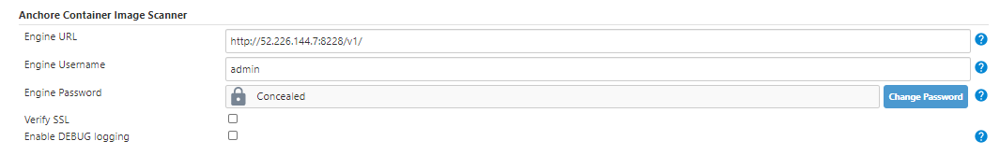
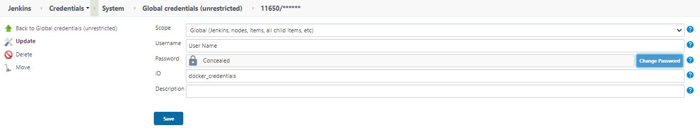
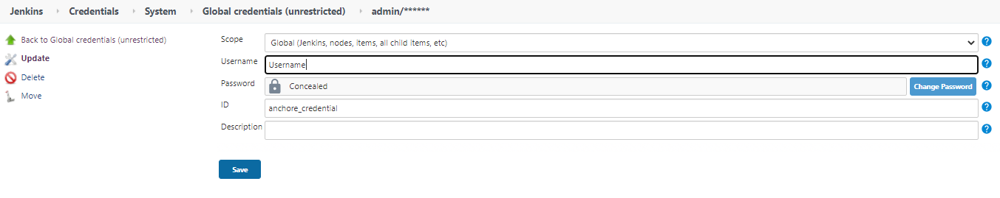
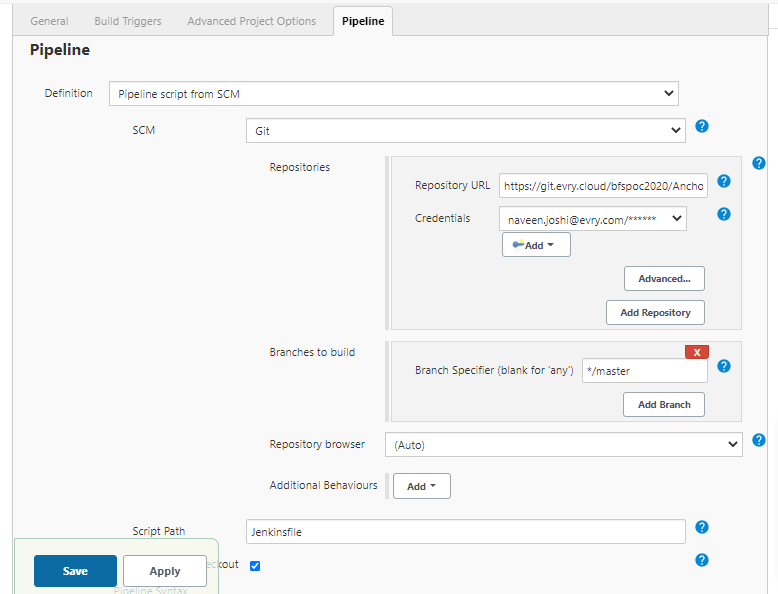

# Anchore Engine [](https://circleci.com/gh/anchore/anchore-engine/tree/master)

The Anchore Engine is an open-source project that provides a centralized service for inspection, analysis, and certification of container images. The Anchore Engine is provided as a Docker container image that can be run standalone or within an orchestration platform such as Kubernetes, Docker Swarm, Rancher, Amazon ECS, and other container orchestration platforms.

The Anchore Engine can be accessed directly through a RESTful API or via the Anchore [CLI](https://github.com/anchore/anchore-cli).

With a deployment of Anchore Engine running in your environment, container images are downloaded and analyzed from Docker V2 compatible container registries and then evaluated against user-customizable policies to perform security, compliance, and best practices enforcement checks.

Anchore Engine can be used in several ways:

* Standalone or interactively.
* As a service integrated with your CI/CD to bring security/compliance/best-practice enforcement to your build pipeline
* As a component integrated into existing container monitoring and control frameworks via integration with its RESTful API.

Anchore Engine is also the OSS foundation for [Anchore Enterprise](https://anchore.com/enterprise), which adds a graphical UI (providing policy management, user management, a summary dashboard, security and policy evaluation reports, and many other graphical client controls), and other back-end features and modules.

**Supported Operating Systems**

- Alpine
- Amazon Linux 2
- CentOS
- Debian
- Google Distroless
- Oracle Linux
- Red Hat Enterprise Linux
- Red Hat Universal Base Image (UBI)
- Ubuntu


**Supported Packages**

- GEM
- Java Archive (jar, war, ear)
- NPM
- Python (PIP)


## Installation

There are several ways to get started with Anchore Engine, for the latest information on quickstart and full production installation with docker-compose, Helm, and other methods, please visit:

- [Anchore Engine Installation](https://docs.anchore.com/current/docs/engine/engine_installation/)

The Anchore Engine is distributed as a [Docker Image](https://hub.docker.com/r/anchore/anchore-engine/) available from DockerHub.

- [Kubernetes Installation](https://anchore.com/blog/anchore-kubernetes/)


## Quick Start (TLDR)

See [documentation](https://docs.anchore.com/current/docs/engine/quickstart/) for the full quickstart guide.

To quickly bring up an installation of Anchore Engine on a system with docker (and docker-compose) installed, follow these simple steps:

```
curl https://docs.anchore.com/current/docs/engine/quickstart/docker-compose.yaml > docker-compose.yaml
docker-compose up -d
```

Once the Engine is up and running, you can begin to interact with the system using the CLI.

## Getting Started using the CLI

The [Anchore CLI](https://github.com/anchore/anchore-cli) is an easy way to control and interact with the Anchore Engine.

The Anchore CLI can be installed using the Python pip command, or by running the CLI from the [Anchore Engine CLI](https://hub.docker.com/r/anchore/engine-cli) container image.

## CLI Quick Start (TLDR)

By default, the Anchore CLI tries to connect to the Anchore Engine at http://localhost:8228/v1 with no authentication.
The username, password, and URL for the server can be passed to the Anchore CLI as command-line arguments:

    --u   TEXT   Username     eg. admin
    --p   TEXT   Password     eg. foobar
    --url TEXT   Service URL  eg. http://localhost:8228/v1

Rather than passing these parameters for every call to the tool, they can also be set as environment variables:

    ANCHORE_CLI_URL=http://myserver.example.com:8228/v1
    ANCHORE_CLI_USER=admin
    ANCHORE_CLI_PASS=foobar
    export ANCHORE_CLI_URL
    export ANCHORE_CLI_USER
    export ANCHORE_CLI_PASS


Add an image to the Anchore Engine:

    anchore-cli image add docker.io/library/debian:latest

Wait for the image to move to the 'analyzed' state:

    anchore-cli image wait docker.io/library/debian:latest

List images analyzed by the Anchore Engine:

    anchore-cli image list

Get image overview and summary information:

    anchore-cli image get docker.io/library/debian:latest

List feeds and wait for at least one vulnerability data feed sync to complete. The first sync can take some time (20-30 minutes) after that syncs will only merge deltas.

    anchore-cli system feeds list
    anchore-cli system wait

Obtain the results of the vulnerability scan on an image:

    anchore-cli image vuln docker.io/library/debian:latest os

List operating system packages present in an image:

    anchore-cli image content docker.io/library/debian:latest os

Perform a policy evaluation against an image using the default policy:

    anchore-cli evaluate check docker.io/library/debian:latest

View other available policies from the [Anchore Policy Hub](https://www.github.com/anchore/hub)

    anchore-cli policy hub --help
    anchore-cli policy hub list

## Configure Anchore with Jenkins
## Prerequisite

You need to install these plugins

     Docker Compose Build Step plugin
     Anchore-Container-Scanner plugin
     docker-build-step plugin
     Docker plugin
     CloudBees Docker Build and Publish plugin
     
 ## Note: You shoud have Docker cli and Deamon running in your Jenkins Server.
 
 For free style job please follow this link (https://plugins.jenkins.io/anchore-container-scanner/)
 
 ## For pipleline clone this repository and configure the pipleline.
      Configure Anchore-Container-Scanner Plugin
      Click on Manage Jenkins >> Configure System 
 


## Configure Docker Credentials
      Click on Manage Jenkins >> Manage Credentials



## Configure Anchore Admin Credentails
      Click on Manage Jenkins >> Manage Credentails
      


## Configure Jenkins pipeline
      Click on Job >> Pipeline >> Name


## More Information

For further details on the use of the Anchore CLI with the Anchore Engine, please refer to the [Anchore Engine Documentation](https://docs.anchore.com)

